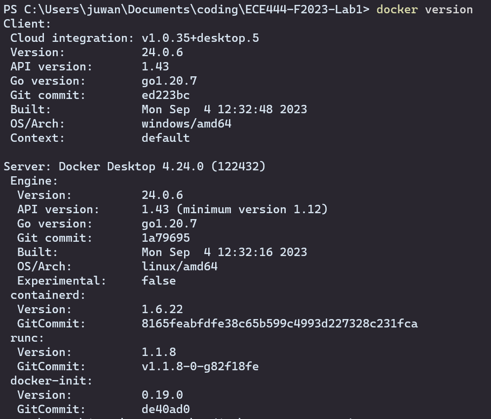
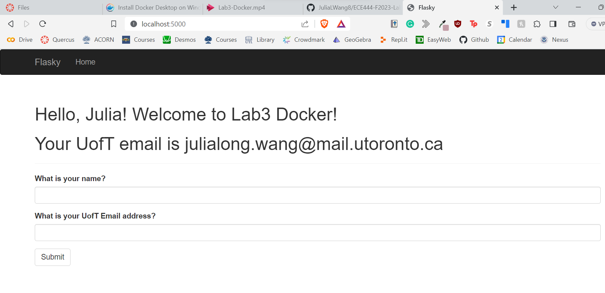
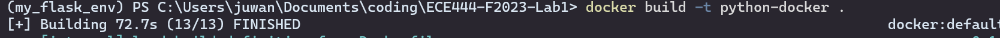
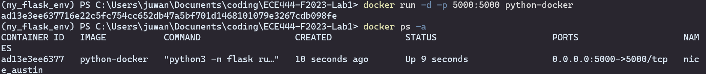
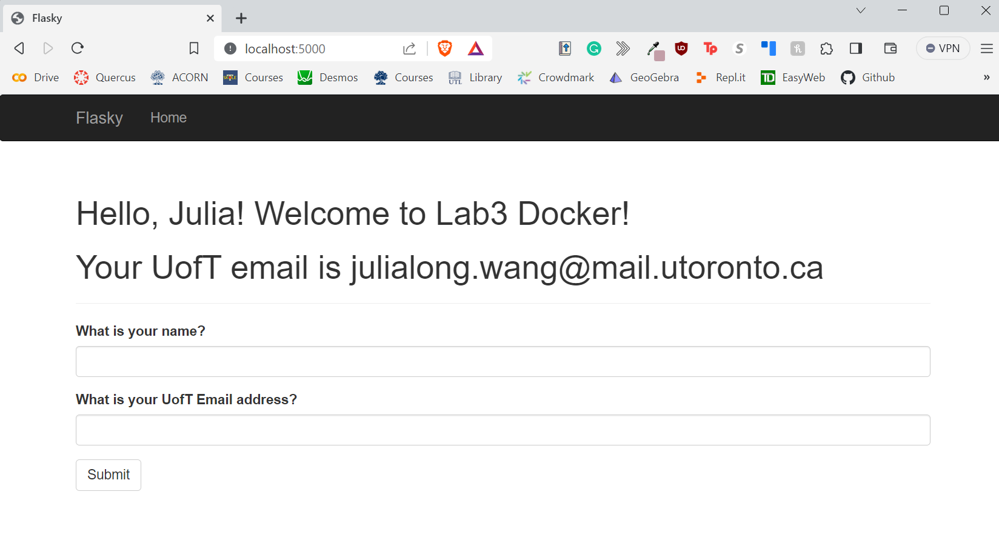

# ECE444-F2023-Lab3

### Activity 2: Docker installation

### Activity 3: Getting things ready locally

### Activity 4: Building and running the docker image locally
Screenshots of the commands used:

Screenshot of the running application:
